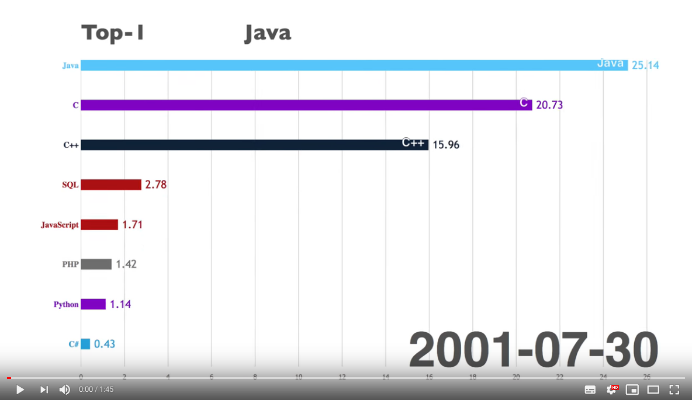

# Pycolee (Python Community Lessons and Exercises)

**Italian translation only. English translation will be available soon!!!**

Benvenuti su **Pycolee**.

**Pycolee** si prefigge come scopo quello di creare una community dove poter condividere gratuitamente e liberamente esercizi e lezioni usando come linguaggio di programmazione Python (https://www.python.org/)

